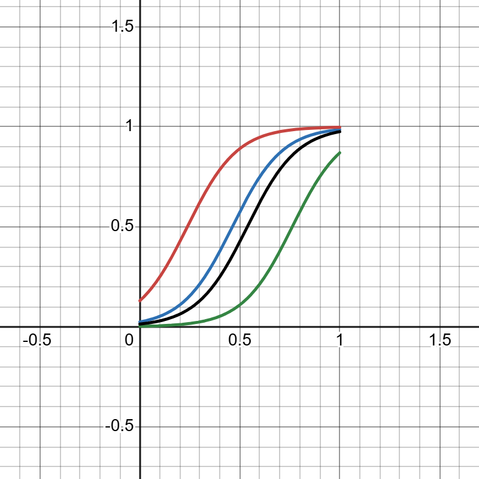

# AI HALLUCINATION — A Conceptual Mathematical Model

เว็บไซต์ Project Showcase (Static Site) สำหรับโครงงาน "แบบจำลองเชิงแนวคิดเพื่ออธิบายความเสี่ยงของ AI Hallucination"
โดย **Krittayod Vipromha** (2610717302033) คณะวิศวกรรมศาสตร์ สาขาวิศวกรรมคอมพิวเตอร์และปัญญาประดิษฐ์
มหาวิทยาลัยหอการค้าไทย

พร้อม Deploy บน **GitHub Pages** ได้ทันที — ไม่มี Backend, ใช้ HTML + CSS + JavaScript ล้วน

---

## 1. โครงสร้างไฟล์ทั้งหมด

```
aihallucination/
├── index.html                 ← หน้าเว็บหลัก (โครงสร้างทั้ง 13 ส่วน)
├── style.css                  ← ดีไซน์ทั้งหมด (Dark theme, Glassmorphism, Grid)
├── script.js                  ← Interactivity ทั้งหมด (สมการ, กราฟ, สไลเดอร์, particle)
├── README.md                  ← ไฟล์นี้
└── assets/
    ├── images/
    │   ├── hallucination-comparison.jpg   (ภาพเปรียบเทียบ Correct vs Hallucinated)
    │   ├── desmos-scenarios-curve.png     (กราฟ Logistic 4 สถานการณ์จาก Desmos)
    │   ├── desmos-linear-ref.png          (กราฟอ้างอิงเพิ่มเติมจาก Desmos)
    │   ├── diagram-risk-model-en.png      (แผนภาพ Risk Model ภาษาอังกฤษ)
    │   └── diagram-experiment-flow-th.png (ผังขั้นตอนการทดลอง ภาษาไทย)
    └── docs/
        ├── conceptual-model-report.pdf         (รายงานฉบับเต็ม — แหล่งข้อมูลหลัก)
        └── decoding-ai-hallucination-slides.pdf (เอกสารประกอบ Self-Verification)
```

ทุก path ในเว็บไซต์เป็น **relative path** (`assets/...`) จึงเปิดได้ทั้งจากเครื่องตัวเอง (double-click `index.html`)
และจาก GitHub Pages โดยไม่ต้องแก้โค้ดใด ๆ เพิ่มเติม

---

## 2. Code ของทุกไฟล์

Code ทั้งหมดอยู่ในไฟล์ `index.html`, `style.css`, `script.js` ที่สร้างไว้ในโปรเจกต์นี้แล้ว
(ดาวน์โหลด/คัดลอกทั้งโฟลเดอร์ `aihallucination/` ไปใช้งานได้ทันที)

Libraries ภายนอกที่ใช้ (โหลดผ่าน CDN เท่านั้น ไม่ต้องติดตั้งอะไรเพิ่ม):
- **Google Fonts** — Space Grotesk, Inter, JetBrains Mono, Noto Sans Thai
- **KaTeX** (`cdn.jsdelivr.net/npm/katex@0.16.9`) — สำหรับแสดงสมการคณิตศาสตร์

---

## 3. วิธีนำขึ้น GitHub

### วิธีที่ 1 — ผ่านเว็บ GitHub (ไม่ต้องใช้ Terminal)
1. ไปที่ [github.com](https://github.com) → ล็อกอิน → กด **New repository**
2. ตั้งชื่อ repo เช่น `ai-hallucination-model` → เลือก Public → กด **Create repository**
3. กด **uploading an existing file** → ลากไฟล์/โฟลเดอร์ทั้งหมด (`index.html`, `style.css`, `script.js`, `README.md`, โฟลเดอร์ `assets/`) เข้าไป
4. กด **Commit changes**

### วิธีที่ 2 — ผ่าน Git บนเครื่อง (Terminal)
```bash
cd aihallucination
git init
git add .
git commit -m "Initial commit: AI Hallucination conceptual model site"
git branch -M main
git remote add origin https://github.com/<ชื่อผู้ใช้>/ai-hallucination-model.git
git push -u origin main
```

---

## 4. วิธีเปิดใช้งาน GitHub Pages

1. เข้า repository บน GitHub → แท็บ **Settings**
2. เมนูซ้าย เลือก **Pages**
3. หัวข้อ **Build and deployment → Source** เลือก **Deploy from a branch**
4. **Branch** เลือก `main` และโฟลเดอร์เลือก `/ (root)` → กด **Save**
5. รอประมาณ 1–2 นาที เว็บไซต์จะพร้อมใช้งานที่
   `https://<ชื่อผู้ใช้>.github.io/ai-hallucination-model/`

---

## 5. วิธีเพิ่ม/เปลี่ยนรูปภาพใน assets

1. เตรียมไฟล์ภาพใหม่ (แนะนำ `.jpg` หรือ `.png`, ขนาดไม่เกิน ~1–2 MB ต่อไฟล์เพื่อความเร็วในการโหลด)
2. นำไฟล์ไปวางในโฟลเดอร์ `assets/images/` (หรือ `assets/docs/` สำหรับ PDF)
3. เปิด `index.html` ค้นหาบรรทัดที่มี `src="assets/images/ชื่อไฟล์เดิม.png"`
4. แก้ชื่อไฟล์ในนั้นให้ตรงกับไฟล์ใหม่ที่เพิ่มเข้าไป เช่น
   ```html
   
   ```
   เปลี่ยนเป็น
   ```html
   
   ```
5. บันทึกไฟล์ แล้ว commit + push ขึ้น GitHub อีกครั้ง (หรืออัปโหลดไฟล์ใหม่ผ่านหน้าเว็บ GitHub)
   GitHub Pages จะอัปเดตอัตโนมัติภายในไม่กี่นาที

> หมายเหตุ: ชื่อไฟล์ภาพ/PDF ห้ามมีช่องว่างหรืออักขระพิเศษ เพื่อป้องกันปัญหา path เสียบน GitHub Pages
> (ไฟล์ในโปรเจกต์นี้ถูกตั้งชื่อใหม่เป็นภาษาอังกฤษ-ขีดกลางไว้แล้วทั้งหมด)

---

## 6. การตรวจสอบว่าเว็บไซต์เปิดได้จริง

- ทุก path ของภาพและ PDF เป็น relative path ที่ตรงกับไฟล์จริงในโฟลเดอร์ `assets/` — ตรวจสอบแล้วว่าไม่มีไฟล์หรือ path ที่หาย
- ไม่มีการเรียกใช้ Backend, API key หรือฐานข้อมูลใด ๆ — ใช้งานได้ทันทีทั้งแบบเปิดไฟล์ในเครื่องและบน GitHub Pages
- Library ภายนอกทั้งหมดโหลดผ่าน CDN ที่เสถียร (jsdelivr, Google Fonts)
- ทดสอบ Responsive ที่ breakpoints หลัก: มือถือ (≤680px), แท็บเล็ต (≤980px), เดสก์ท็อป
- รองรับ `prefers-reduced-motion` และมี `<noscript>` fallback ให้เนื้อหาแสดงผลได้แม้ปิด JavaScript

---

## ข้อมูลสำคัญเกี่ยวกับแบบจำลอง

พารามิเตอร์ในสมการ (a=8, b=4, c=3, d=2, k=−5) เป็น **ค่าที่สมมติขึ้นเพื่อสาธิตพฤติกรรมของแบบจำลองเท่านั้น**
ไม่ใช่ค่าที่ได้จากการฝึกฝนหรือวัดจากระบบ AI จริง และเกณฑ์ระดับความเสี่ยง (Low/Medium/High) เป็นเกณฑ์เชิงแนวคิด
สำหรับการแสดงผลในรายงานนี้เท่านั้น มิใช่มาตรฐานทางวิทยาศาสตร์หรืออุตสาหกรรม รายละเอียดทั้งหมดอ้างอิงจาก
`assets/docs/conceptual-model-report.pdf`
